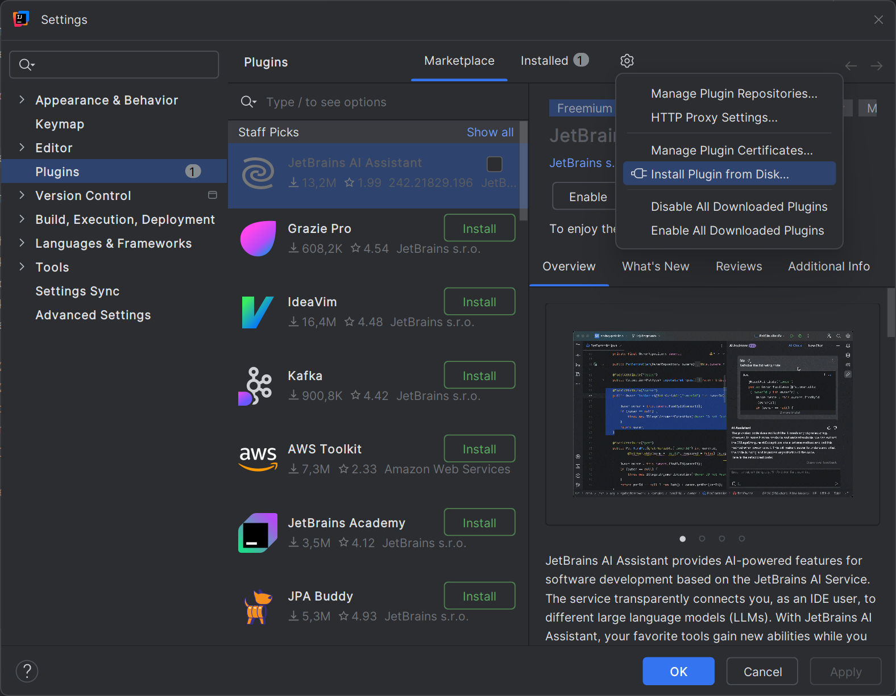
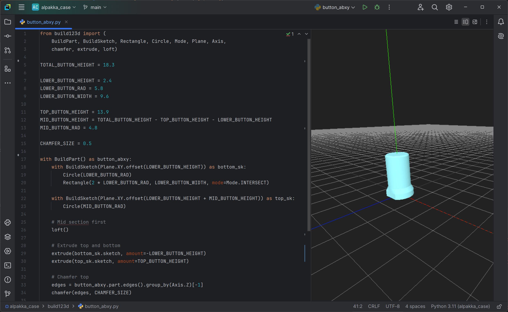

# IntelliJ Build123d Viewer Plugin

[Build123d CAD Viewer Plugin] adds a preview support for 3D models created with [Build123d]
to the [JetBrains IDEs] (mainly [PyCharm]).

For Python files that import `build123d` module, the plugin will show a file editor tab
with a preview of the 3D model using [Three.js] library.

## Important Notice

This plugin is not a part of Build123d project and is not officially supported by Build123d.
Please do not contact Build123d team for support with issues related to this plugin.

This plugin is in early stage of development and currently supports only a limited set of features.
There are performance issues, bugs, and the plugin may not work correctly in all cases.

## Prerequisites

1. IntelliJ IDE with Python plugin installed (tested with PyCharm 2024.2.1 Community Edition)
2. Project set up with Python 3 environment with `build123d` module installed

## Installation

At this moment, the plugin is not available in the JetBrains Plugin Marketplace.
To install the plugin manually, follow these steps:

1. Download the latest version of the plugin from the project's [releases page]
2. Open compatible IntelliJ IDE (see [Prerequisites])
3. In the IntelliJ IDE, open the `File` -> `Settings` -> `Plugins` dialog
4. Click the `⚙️` button and select the `Install Plugin from Disk...` option
5. Select the downloaded plugin file and click the `OK` button
6. Click the `OK` button to close the `Settings` dialog
7. Restart the IntelliJ IDE

## Usage

The plugin will automatically detect Python files that import the `build123d` module.
When you open such a file, the plugin will enable a split file editor with the 3D model preview.

The preview is interactive, and you can rotate, zoom, and pan the 3D model using the mouse.
When you edit the code, the preview will automatically update.

## License

This plugin is licensed under the MIT License. See the [LICENSE](LICENSE) file for details.

[Build123d CAD Viewer Plugin]: https://github.com/tomas-pecserke/intellij_build123d_viewer_plugin/
[Build123d]: https://build123d.readthedocs.io/
[JetBrains IDEs]: https://www.jetbrains.com/ides/
[PyCharm]: https://www.jetbrains.com/pycharm/
[Three.js]: https://threejs.org/

[releases page]: https://github.com/tomas-pecserke/intellij_build123d_viewer_plugin/releases/
